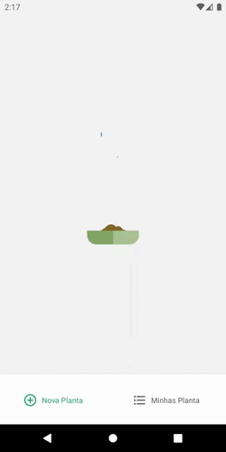
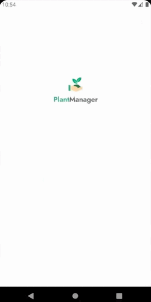

[![License: MIT][license-shield]][license-url]


[![React Native][reactnative-shield]][reactnative-url]
[![Type Script][typescript-shield]][typescript-url]

[![LinkedIn][linkedin-shield]][linkedin-url]


<!-- PROJECT LOGO -->
<br />
<p align="center">
  <a href="https://github.com/totoledao/plant-care-app">
    
  </a>

  <p align="center">
    Stop killing your cactuses! 🌵
    <br />
    <a href="https://github.com/totoledao/plant-care-app"><strong>Explore the docs »</strong></a>    
  </p>
</p>


<!-- TABLE OF CONTENTS -->
<details open="open">
  <summary><h2 style="display: inline-block">Table of Contents</h2></summary>
  <ol>
    <li>
      <a href="#about-the-project">About The Project</a>
      <ul>
        <li><a href="#built-with">Built With</a></li>
        <li><a href="#technologies">Technologies</a></li>
      </ul>
    </li>
    <li>
      <a href="#getting-started">Getting Started</a>
      <ul>
        <li><a href="#prerequisites">Prerequisites</a></li>
        <li><a href="#installation">Installation</a></li>
      </ul>
    </li>    
    <li><a href="#usage">Usage</a></li>
    <li><a href="#contributing">Contributing</a></li>
    <li><a href="#license">License</a></li>
    <li><a href="#contact">Contact</a></li>    
  </ol>
</details>


<!-- ABOUT THE PROJECT -->
## About The Project


**Schedule your waterings, check when your plants will need water again, categorize and sort your plants, get reminded and never let your plants die again!**

App created during Next Level 5 by [Rocketseat](https://rocketseat.com.br/).

### Built With

* [React Native](https://reactnative.dev/)
* [Typescript](https://www.typescriptlang.org/)
* [Expo](https://expo.io/)

### Technologies
* Axios
* Lottie
* React Navigation
* json-server
* date-fns

<!-- GETTING STARTED -->
## Getting Started

To get a local copy up and running follow these simple steps.

### Prerequisites

* npm
  ```sh
  npm install npm@latest -g
  ```
* Expo CLI
  ```sh
  npm install --global expo-cli
  ```

### Installation

1. Clone the repo
   ```sh
   git clone https://github.com/totoledao/plant-care-app.git
   ```
2. Install dependencies
   ```sh
   npm install
   ```
3. Start the development server with expo
   ```sh
   expo start
   ```
4. Start JSON Server
   ```sh
    json-server --watch ./src/services/server.json --host 192.168.0.4 --port 3333
   ```



**NOTE:** Your gateway IP (IPv4) might be different or change over time. If you are stuck on the loading screen update _./src/services/api.ts_ and _step 4_ with your IP and try again.
<!-- USAGE EXAMPLES -->
## Usage



The app is more like a proof of concept at the current state, so enter your name and schedule the watering of your plants. There are few plants to choose from but they have different watering needs, so you will find one that will be suitable for your plants.

<!-- CONTRIBUTING -->
## Contributing

Contributions make the open source community such an amazing place to be, learn, inspire, and create. Any contributions you make are **greatly appreciated**.

1. Fork the Project
2. Create your Feature Branch (`git checkout -b feature/AmazingFeature`)
3. Commit your Changes (`git commit -m 'Add some AmazingFeature'`)
4. Push to the Branch (`git push origin feature/AmazingFeature`)
5. Open a Pull Request


<!-- LICENSE -->
## License

Distributed under the MIT License. See [`LICENSE`][license-url] for more information.


<!-- CONTACT -->
## Contact

Guilherme Toledo - guilherme-toledo@live.com

[](https://www.linkedin.com/in/guilhermemtoledo/)
[](https://www.facebook.com/totoledao)
[](https://www.instagram.com/totoledao)
[](https://www.github.com/totoledao)


Project Link: [https://github.com/totoledao/plant-care-app](https://github.com/totoledao/plant-care-app)

<!-- MARKDOWN LINKS & IMAGES -->
<!-- https://www.markdownguide.org/basic-syntax/#reference-style-links -->

[license-shield]: https://img.shields.io/badge/License-MIT-blue.svg
[license-url]: https://github.com/totoledao/plant-care-app/blob/main/MIT-LICENSE.txt
[linkedin-shield]: https://img.shields.io/badge/-LinkedIn-black.svg?style=for-the-badge&logo=linkedin&colorB=0e76a8
[linkedin-url]: http://www.linkedin.com/in/guilhermemtoledo
[reactnative-shield]:https://img.shields.io/badge/React_Native-20232A?style=for-the-badge&logo=react&logoColor=61DAFB
[reactnative-url]: https://reactnative.dev/
[typescript-shield]:https://img.shields.io/badge/TypeScript-007ACC?style=for-the-badge&logo=typescript&logoColor=white
[typescript-url]: https://www.typescriptlang.org/
